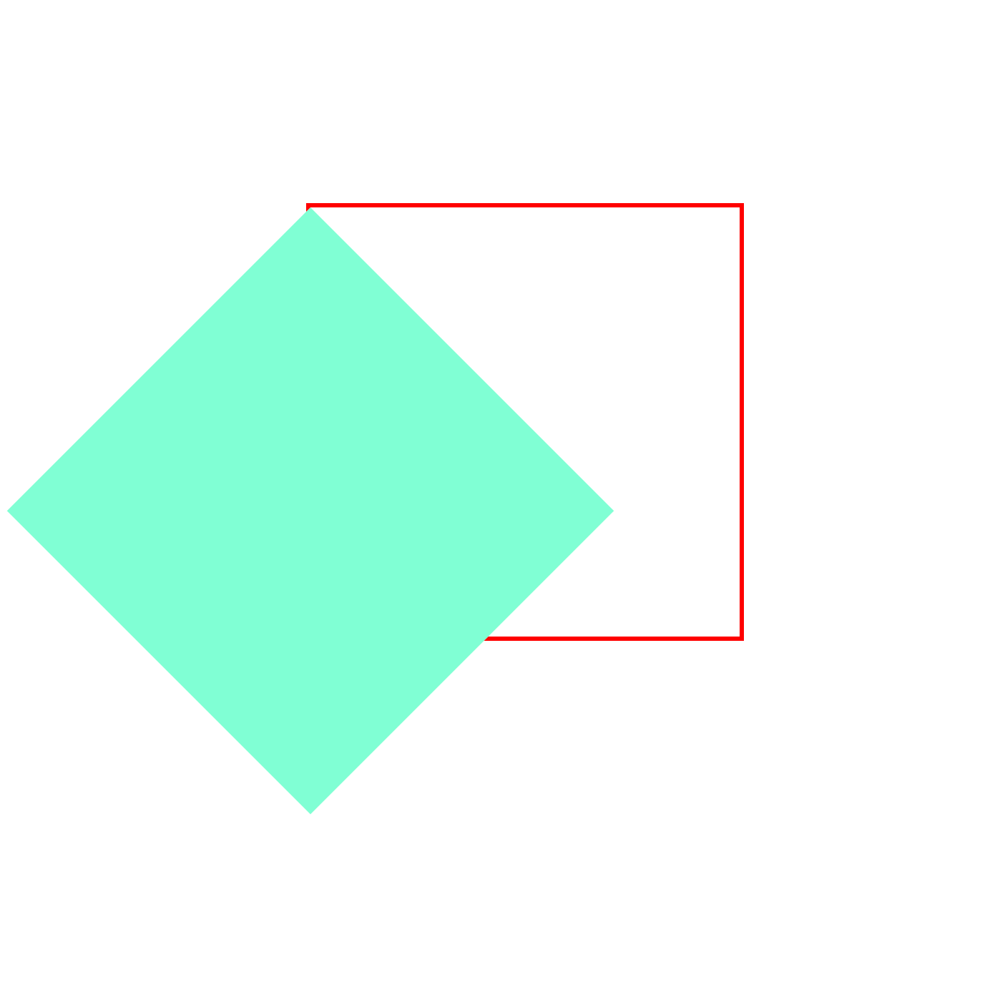
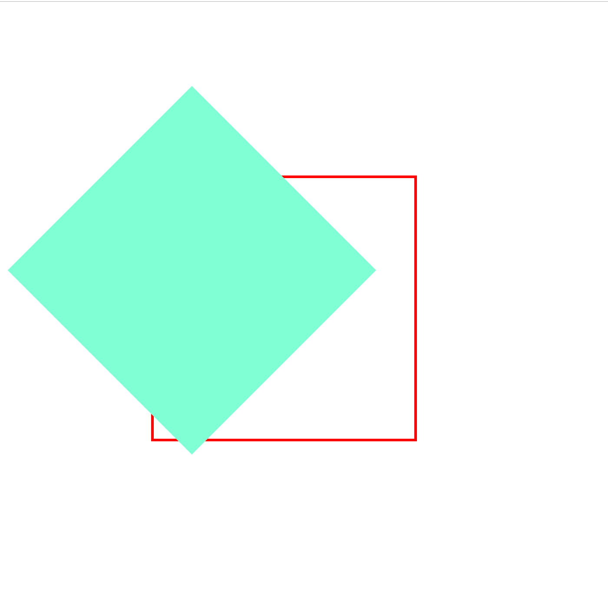
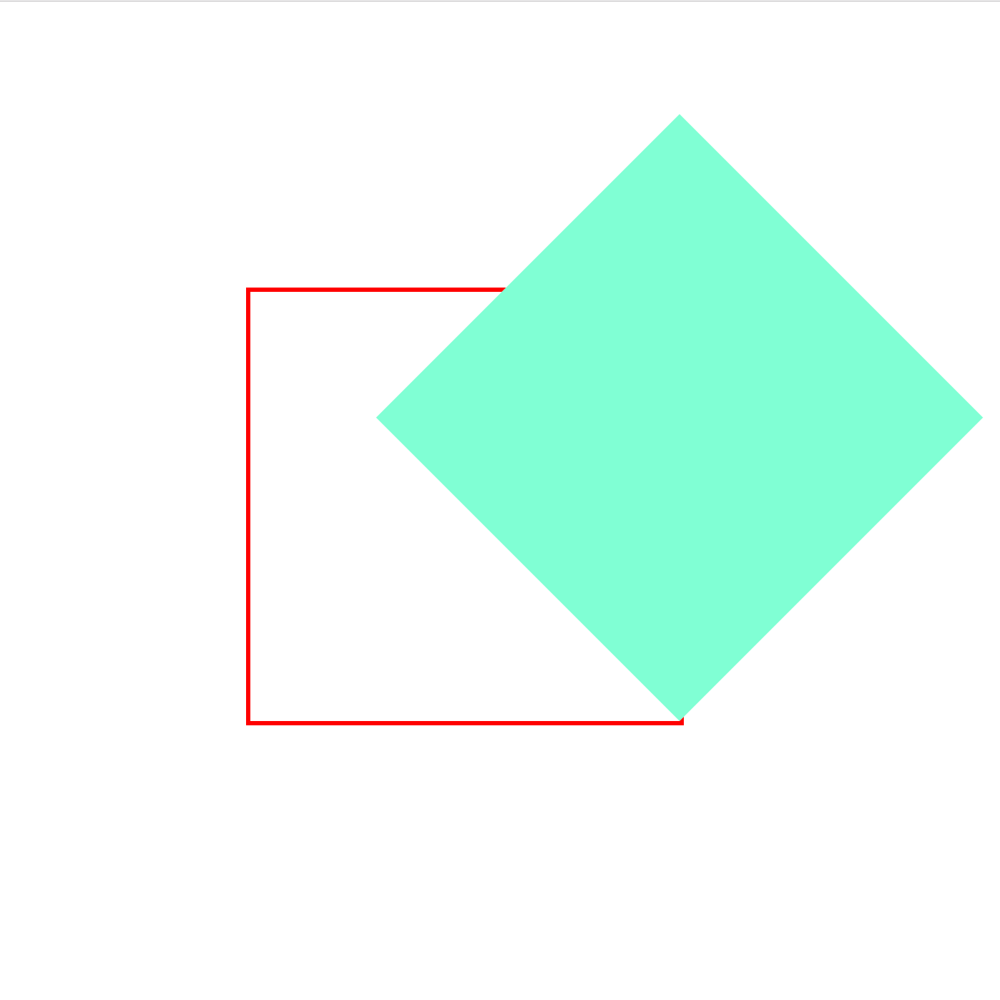

### 2d形态下transform-origin

transform-origin 属性用来设置 transform 变换的基点位置。默认情况下，基点位置为元素的中心点。

0.原状态


1.默认基点位置为元素的中心点

`transform: rotate(45deg);`


2.像素值改变基点位置

```
transform: rotate(45deg);

transform-origin: 0 0;
```




3.用位置描述来改变基点位置

```
transform: rotate(45deg);

transform-origin: top center;
```




4.百分比改变基点位置

```
transform: rotate(45deg);

transform-origin: 100% 100%;
```

